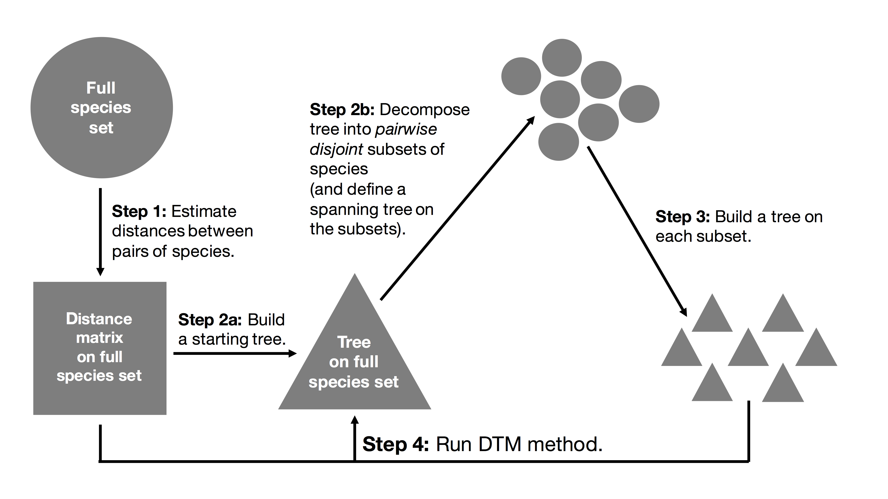
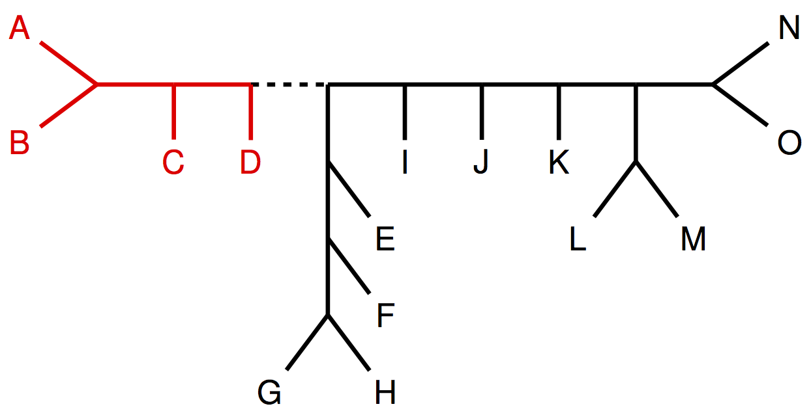
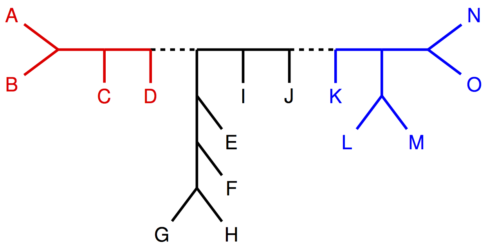
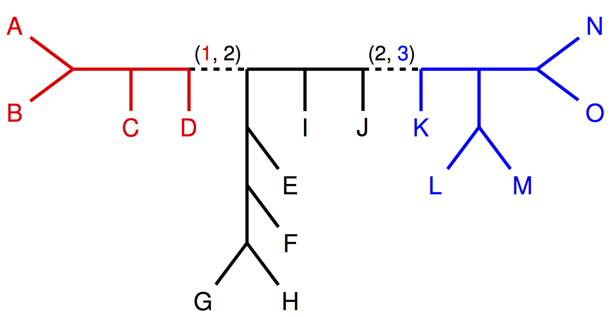

Divide-and-Conquer Pipelines based on Concatenation
===================================================
The goal of this tutorial is to get experience using [SVDquartets](https://academic.oup.com/bioinformatics/article/30/23/3317/206559) in the context of the divide-and-conquer pipeline shown below.




For the purposes of this tutorial, we will analyze a small simulated dataset with 
+ 100 in-group species and 1 out-group species,
+ 1000 genes, and
+ gene tree heterogeneity due to incomplete lineage sorting.

However, divide-and-conquer pipelines should really be used with larger numbers of species, specifically datasets on which SVDquartets *cannot* run given your computational resources.


To begin, open a terminal and `cd` into the tutorial repository. For example, if you downloaded the tutorial into your `Downloads` directory, then you would type the following command
```
cd ~/Downloads/trees-in-the-desert-tutorial-master
```
into the terminal. You can see which directory you are in by typing
```
pwd
```
into the terminal, and you can see a list of files in this directory by typing
```
ls
```
into the terminal. You should see a folder, called `software`. If you are using Windows, you need to install PAUP* using `paup4-setup.msi`.


Part I
------
In the first step of the divide-and-conquer pipeline, we need to compute distances between pairs of taxa based on the concatenated alignment. Here we use the [log-det distance](https://www.sciencedirect.com/science/article/pii/0893965994900248) between pairs of sequences, which has been proven to be a statistically consistent method for estimating a species tree under the MSC+GTR model by [Allman et al., 2019](https://epubs.siam.org/doi/abs/10.1137/18M1194134) when the sequence evolution models across genes satisfy some additional assump- tions (e.g., a relaxed molecular clock). 

We can use [PAUP*](https://paup.phylosolutions.com) to build the log-det matrix with the following command:

```
echo  "exe data-cat/cataln.nex; DSet distance=logdet; SaveDist format=PHYLIP file=logdet-mat.txt triangle=both diagonal=yes;" | ./software/paup4a165_osx -n
```

If you are using linux, replace `paup4a165_osx` with `paup4a165_centos64` or `paup4a165_ubuntu64`. If you are using Windows, you should do something special based on the install with `paup4-setup.msi`.

The two **input** options specify
+ `[concatenated alignment in nexus format]` (see [here](data-cat/cataln.nex))
+ `[output file name]`

and the **output** is the log-det matrix in phylip format (see [here](data-cat/logdet-mat.txt)).


Part II
-------
In the second step of the divide-and-conquer pipeline, we need to decompose the taxon set into subsets (and build a spanning tree on the subsets if using TreeMerge). Because this dataset is sufficiently small, a distance matrix can be built on the full set of species. We ran NJ on this distance matrix to get a starting tree, and then decomposed the starting tree by deleting edges to create subsets; in this case, the starting tree also defines a spanning tree on the subsets.


For example, by deleting a single edge, the tree (below) is divided into two subsets (colored red and black).



Then by deleting a second edge, the black subset is divided into two subsets (colored blue and black). This produces three subsets (colored red, blue, and black) so that each taxon appears in exactly one subset, i.e., the subsets are pairwise disjoint.



Note that the deleted edges in the starting tree define a spanning tree on the subsets, specifically, there is an edge between the red subset and the black subset as well as an edge between the black subset and the blue subset.




To simplify this tutorial, we have already performed step 2; note that in the newest versions of NJMerge and TreeMerge being released this month, this step is automated.


Part III
--------
In the third step of the divide-and-conquer pipeline, we need to estimate a species trees on each subset of taxa. We can use [SVDquartets](https://academic.oup.com/bioinformatics/article/30/23/3317/206559) to estimate a species tree from the concatenated alignment with the following command:
```
echo "exe data-cat/cataln-subset-1-outof-5.nex; svd nthreads=1 evalQuartets=all qfile=paup-quartets-$name.txt qformat=qmc; savetrees file=svdquartets-subset-1-outof-5-tre.txt format=newick;" | ./software/paup4a165_osx -n
```

If you are using linux, replace `paup4a165_osx` with `paup4a165_centos64` or `paup4a165_ubuntu64`. If you are using Windows, you should do something special based on the install with `paup4-setup.msi`.

The two **input** options specify
+ `[concatenated alignment on the taxa in subset 1 in newick format]` (see [here](data/cataln-subset-1-outof-5.nex))
+ `[number of quartets to evaluate]`
+ `[output file name]`

The **output** is the species tree for the taxa in subset 1 in newick format (see [here](data-cat/svdquartets-subset-1-outof-5-tre.txt)).

*Repeat part III for subsets 2 (i.e., the file called svdquartets-subset-2-outof-5-tre.txt), 3, 4, and 5.*


Part IV
-------
In the fourth step of the divide-and-conquer pipeline, we need to run a DTM method (e.g., NJMerge or TreeMerge). In order to run [NJMerge](https://link.springer.com/chapter/10.1007%2F978-3-030-00834-5_15), use the following command:

```
./software/njmerge-osx \
    -t data-cat/svdquartets-subset-1-outof-5-tre.txt \
       data-cat/svdquartets-subset-2-outof-5-tre.txt \
       data-cat/svdquartets-subset-3-outof-5-tre.txt \
       data-cat/svdquartets-subset-4-outof-5-tre.txt \
       data-cat/svdquartets-subset-5-outof-5-tre.txt \
    -m data-cat/logdet-mat.txt \
    -o njmerge-on-svdquartets-and-logdet-tre.txt
```

If you are using linux or windows, install [Dendropy](https://dendropy.org) and [NumPy](http://www.numpy.org) (if necessary), and replace `./software/njmerge-osx` with `python software/njmerge.py`.


The **input** options specify
+ `-t [estimated subset trees in newick format]` (see [here](data-cat/svdquartets-subset-1-outof-4-tre.txt))
+ `-m [estimated dissimilarity matrix in phylip format]` (see [here](data/logdet-mat.txt))
+ `-o [output file name]`

The **output** is the species tree on full taxon set in newick format (see [here](data-cat/njmerge-on-svdquartets-and-logdet-tre.txt)).

In order to run TreeMerge (Molloy and Warnow, ISMB 2019) use the following command:
```
./software/treemerge-osx \
    -s data-cat/nj-on-logdet-tre.txt \
    -t data-cat/svdquartets-subset-1-outof-5-tre.txt \
       data-cat/svdquartets-subset-2-outof-5-tre.txt \
       data-cat/svdquartets-subset-3-outof-5-tre.txt \
       data-cat/svdquartets-subset-4-outof-5-tre.txt \
       data-cat/svdquartets-subset-5-outof-5-tre.txt \
    -m data-cat/logdet-mat.txt \
    -o treemerge-on-svdquartets-and-logdet-tre.txt \
    -w . \
    -p software/paup4a165_osx
```

If you are using linux or windows, install [NetworkX](https://networkx.github.io) (if necessary), replace `./software/treemerge-osx` with `python software/treemerge.py`. If you are using linux, replace `paup4a165_osx` with `paup4a165_centos64` or `paup4a165_ubuntu64`. If you are using Windows, you should do something special based on the install with `paup4-setup.msi`.

The **input** options are the same as NJMerge, but you must also provide either the spanning tree for the subsets (or else the starting tree that was used to decompose the species set into subsets) and [PAUP*](http://phylosolutions.com/paup-test/), which is used to estimate branch lengths.
+ `-s [starting tree used to define subsets in newick format]` (see [here](data-cat/nj-on-logdet-tre.txt))
+ `-w [working directory to write temporary files in]`
+ `-p [path to PAUP* binary]`

The **output** is also species tree on full taxon set in newick format (see [here](data-cat/treemerge-on-svdquartets-and-logdet-tre.txt)).


Part V
------
Now that you have an estimated species tree topology on the full taxon set, you may want to estimate branch support. This could be done using a multi-locus bootstrapping approach; see [here](https://github.com/smirarab/multi-locus-bootstrapping).
