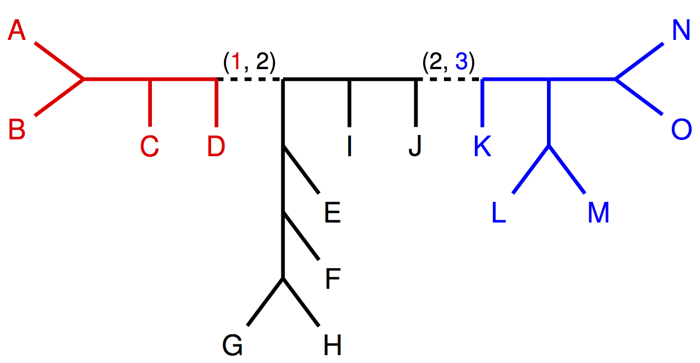

Divide-and-Conquer Pipelines based on Gene Tree Summary Methods
===============================================================
The goal of this tutorial is to get experience using gene tree summary methods ([ASTRID](https://bmcgenomics.biomedcentral.com/articles/10.1186/1471-2164-16-S10-S3) and [ASTRAL](https://bmcbioinformatics.biomedcentral.com/articles/10.1186/s12859-018-2129-y)) in the context of the divide-and-conquer pipeline shown below.


For the purposes of this tutorial, we will analyze a small simulated dataset with 
+ 100 in-group species and 1 out-group species,
+ 1000 genes, and
+ gene tree heterogeneity due to incomplete lineage sorting.

However, divide-and-conquer pipelines should really be used with larger numbers of species, specifically datasets on which ASTRAL *cannot* run given your computational resources.


In real life, you would need to estimate gene trees and need to think about many practical issues, including fragmentary sequences, missing data, gene tree estimation error (i.e., gene trees with many low-support branches), and so on. If these situations occur, you may want to take a look at the following papers on
+  whether or not to remove fragmentary sequences before estimating gene trees [(Sayyari et al., 2017)](https://academic.oup.com/mbe/article/34/12/3279/4344836)
+ whether or not to collapse low support branches in the estimated gene trees [(Zhang et al., 2018)](https://bmcbioinformatics.biomedcentral.com/articles/10.1186/s12859-018-2129-y)
+ whether or not to exclude genes based on estimation error or missing data [(Molloy and Warnow, 2018)](https://academic.oup.com/sysbio/article/67/2/285/4159193)

For this tutorial, we have already estimated gene trees, so you do not worry about these issues. To begin, you need to clone (or download and unzip) this repository.


Now open a terminal and `cd` into the tutorial repository. For example, if you downloaded the tutorial into your `Downloads` directory, then you would type the following command
```
cd ~/Downloads/trees-in-the-desert-tutorial-master
```
into the terminal. You can see which directory you are in by typing
```
pwd
```
into the terminal, and you can see a list of files in this directory by typing
```
ls
```
into the terminal. You should see a folder, called `software`. Now `cd` into this folder, and unzip the folder containing ASTRAL using the following commands:
```
cd software
unzip Astral.zip
cd ..
```


Part I
------
In the first step of the divide-and-conquer pipeline, we need to compute distances between pairs of taxa based on the estimated gene trees. In the image below, taxon `A` and taxon `H` are separated by 7 internal nodes, so we say the internode distance between `A` and `H` is 7. We can compute the average internode distance between `A` and `H` in all gene trees containing *both* `A` and `H`, called the AGID matrix by [Liu and Yu, 2011](https://academic.oup.com/sysbio/article/60/5/661/1644054) or the USTAR matrix by [Allman et al., 2018](https://ieeexplore.ieee.org/document/7557076/).


[ASTRID](https://bmcgenomics.biomedcentral.com/articles/10.1186/1471-2164-16-S10-S3) is a software package that runs a distance method (typically Balanced Minimum Evolution as implemented inside of [FastME](https://academic.oup.com/mbe/article/32/10/2798/1212138)) on the AGID matrix. We can also use ASTRID to build the AGID matrix with the following command:

```
./software/ASTRID-osx -i data/esti-genes-tre.txt -c agid-mat.txt &> astrid-log.txt
```

If you are using linux or windows, you should run `ASTRID-linux` or `ASTRID.exe`, respectively.

The two **input** options specify
+ `-i [list of estimated gene trees in newick format]` (see [here](data/esti-genes-tre.txt))
+ `-c [output file name]`

and the **output** is the AGID matrix in phylip format (see [here](data/agid-mat.txt)).


Part II
-------
In the second step of the divide-and-conquer pipeline, we need to decompose the taxon set into subsets (and build a spanning tree on the subsets if using TreeMerge). Because this dataset is sufficiently small, a distance matrix can be built on the full set of species. We ran NJ on this distance matrix to get a starting tree, and then decomposed the starting tree by deleting edges to create subsets; in this case, the starting tree also defines a spanning tree on the subsets.


For example, by deleting a single edge, the tree (below) is divided into two subsets (colored red and black).


Then by deleting a second edge, the black subset is divided into two subsets (colored blue and black). This produces three subsets (colored red, blue, and black) so that each taxon appears in exactly one subset, i.e., the subsets are pairwise disjoint.


Note that the deleted edges in the starting tree define a spanning tree on the subsets, specifically, there is an edge between the red subset and the black subset as well as an edge between the black subset and the blue subset.




To simplify this tutorial, we have already performed step 2; note that in the newest versions of NJMerge and TreeMerge being released this month, this step is automated.


Part III
--------
In the third step of the divide-and-conquer pipeline, we need to estimate a species trees on each subset of taxa. We can use [ASTRAL-III](https://bmcbioinformatics.biomedcentral.com/articles/10.1186/s12859-018-2129-y) to estimate a species tree from a set of gene trees with the following command:
```
java -jar software/Astral/astral.5.6.3.jar \
    -i data/esti-genes-subset-1-outof-4-tre.txt \
    -o astral-subset-1-outof-4-tre.txt \
    &> astral-subset-1-outof-4-log.txt
```

The two **input** options specify
+ `-i [list of gene trees on the taxa in subset 1 in newick format]` (see [here](data/esti-genes-subset-1-outof-4-tre.txt); note that this file is just the estimated gene trees used in Part I pruned down to contain only the taxa in subset 1)
+ `-o [output file name]`

The **output** is the species tree for the taxa in subset 1 in newick format (see [here](data/astral-subset-1-outof-4-tre.txt)).

*Repeat part III for subsets 2 (i.e., the file called esti-genes-subset-2-outof-4-tre.txt), 3, and 4.*


Part IV
-------
In the fourth step of the divide-and-conquer pipeline, we need to run a DTM method (e.g., NJMerge or TreeMerge). In order to run [NJMerge](https://link.springer.com/chapter/10.1007%2F978-3-030-00834-5_15), use the following command:

```
./software/njmerge-osx \
    -t data/astral-subset-1-outof-4-tre.txt \
       data/astral-subset-2-outof-4-tre.txt \
       data/astral-subset-3-outof-4-tre.txt \
       data/astral-subset-4-outof-4-tre.txt \
    -m data/agid-mat.txt \
    -x data/agid-mat.txt_taxlist \
    -o njmerge-on-astral-and-agid-tre.txt
```

If you are using linux or windows, install [Dendropy](https://dendropy.org) and [NumPy](http://www.numpy.org) (if necessary), and replace `./software/njmerge-osx` with `python software/njmerge.py`.


The **input** options specify
+ `-t [estimated subset trees in newick format]` (see [here](data/astral-subset-1-outof-4-tre.txt))
+ `-m [estimated dissimilarity matrix in phylip format]` (see [here](data/agid-mat.txt))
+ `-x [list of the names for each row in the dissimilarity matrix]` (see [here](data/agid-mat.txt_taxlist))
+ `-o [output file name]`

The **output** is the species tree on full taxon set in newick format (see [here](data/njmerge-on-astral-and-agid-tre.txt)).

In order to run TreeMerge (Molloy and Warnow, ISMB 2019) use the following command:
```
./software/treemerge-osx \
    -s data/nj-on-agid-tre.txt \
    -t data/astral-subset-1-outof-4-tre.txt \
       data/astral-subset-2-outof-4-tre.txt \
       data/astral-subset-3-outof-4-tre.txt \
       data/astral-subset-4-outof-4-tre.txt \
    -m data/agid-mat.txt \
    -x data/agid-mat.txt_taxlist \
    -o treemerge-on-astral-and-agid-tre.txt \
    -w . \
    -p software/paup4a165_osx
```

If you are using linux or windows, install [NetworkX](https://networkx.github.io) (if necessary), replace `./software/treemerge-osx` with `python software/treemerge.py`. If you are using linux, replace `paup4a165_osx` with `paup4a165_centos64` or `paup4a165_ubuntu64`. If you are using windowns, then install PAUP* with `paup4-setup.msi`.

The **input** options are the same as NJMerge, but you must also provide either the spanning tree for the subsets (or else the starting tree that was used to decompose the species set into subsets) and [PAUP*](http://phylosolutions.com/paup-test/), which is used to estimate branch lengths.
+ `-s [starting tree used to define subsets in newick format]` (see [here](data/nj-on-agid-tre.txt))
+ `-w [working directory to write temporary files in]`
+ `-p [path to PAUP* binary]`

The **output** is also species tree on full taxon set in newick format (see [here](data/treemerge-on-astral-and-agid-tre.txt)).


Part V
------
Now that you have an estimated species tree topology on the full taxon set, you may want to estimate branch lengths (in coalescent units) and support. We can do this with ASTRAL (as described in [Sayyari and Mirarab, 2016](https://academic.oup.com/mbe/article/33/7/1654/2579300)) using the following command:

```
java -jar software/Astral/astral.5.6.3.jar \
    -q data/njmerge-on-astral-and-agid-tre.txt \
    -i data/esti-genes-tre.txt \
    -o scored-njmerge-on-astral-and-agid-tre.txt &> scored-njmerge-on-astral-and-agid-log.txt
```


The **input** options specify
+ `-q [estimated species tree in newick format]` (see [here](data/njmerge-on-astral-and-agid-tre.txt))
+ `-i [list of estimated gene trees in newick format]` (see [here](data/esti-genes-tre.txt))

The **output** is also species tree on full set of species in newick format (see [here](data/scored-njmerge-on-astral-and-agid-tre.txt)), but with branch lengths and branch support.


In the future, you may want to check out, the ASTRAL [tutorial](https://github.com/smirarab/ASTRAL/blob/master/astral-tutorial.md) or [ASTRAL-MP](https://academic.oup.com/bioinformatics/advance-article/doi/10.1093/bioinformatics/btz211/5418955).
